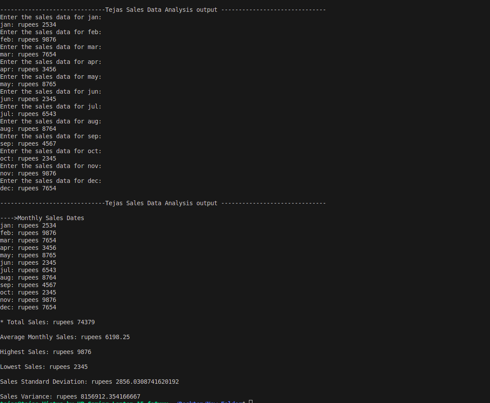

# Sales-Data-Anlysis-terminal-based-project-python
this the first project on python numpy module
# 📊 Sales Data Analysis using NumPy

A beginner-friendly **data analysis project** built with Python and NumPy.  
This project generates random monthly sales data for 12 months and performs key statistical analysis such as **total yearly sales, average monthly sales, best month, and worst month**.  

---

## ✨ Features
✔️ work on given sales data 
✔️ Calculates **total yearly sales**  
✔️ Finds **average monthly sales**  
✔️ Identifies the **best month (highest sales)**  
✔️ Identifies the **worst month (lowest sales)**  

---

## 📂 Project Structure
sales-data-analysis/
![Salesanlysis program architecture (architecture.drawio)

## 📸 Screenshot
Here’s how the program looks when executed:

